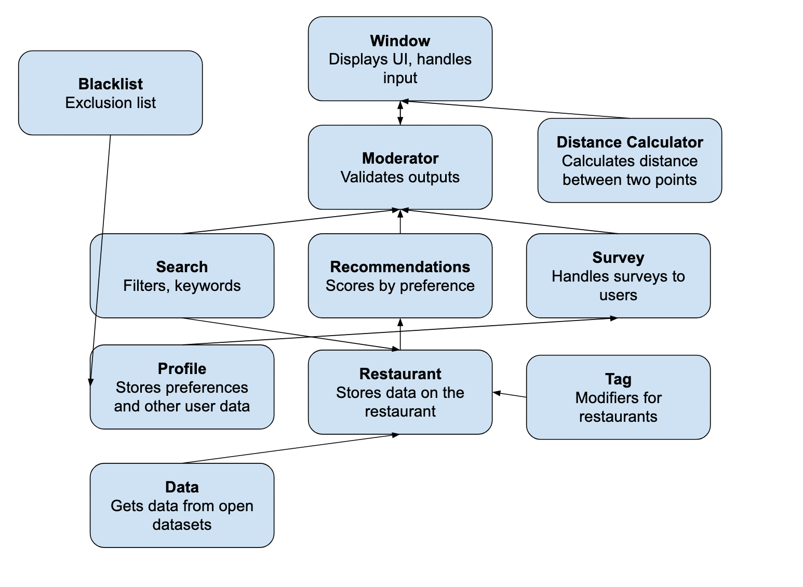

# cs2114-project1-group59
App that recommends food places based off past experience/ratings

**Hungry Hokie** suggests restaurants in the Blacksburg/Christiansburg area based on a user's survey answers, past ratings, budget, and distance.

## Compile and run

From this folder, with Java 11 or newer:

```
javac -d bin -cp "lib/*" src/*.java test/*.java
java -cp "bin;lib/*" Window
```

On Mac/Linux, use `bin:lib/*` (colon instead of semicolon).

## Run the tests

After compiling:

```
java -jar lib/junit-platform-console-standalone-1.14.4.jar execute -cp bin -cp lib/sqlite-jdbc-3.53.4.0.jar --scan-classpath bin
```

## Eclipse

**File → Import → General → Existing Projects into Workspace**, then pick this folder. Run `Window.java` as a Java Application, or right-click the `test` folder → **Run As → JUnit Test**.

## System diagram



## Layout

| Folder | What's in it |
|---|---|
| `src/` | The program's classes. `Window` has `main`. |
| `test/` | JUnit 5 tests: a normal case and a bad-input case for each key method |
| `lib/` | `sqlite-jdbc` (database driver) and the JUnit 5 runner |
| `docs/` | System diagram |
